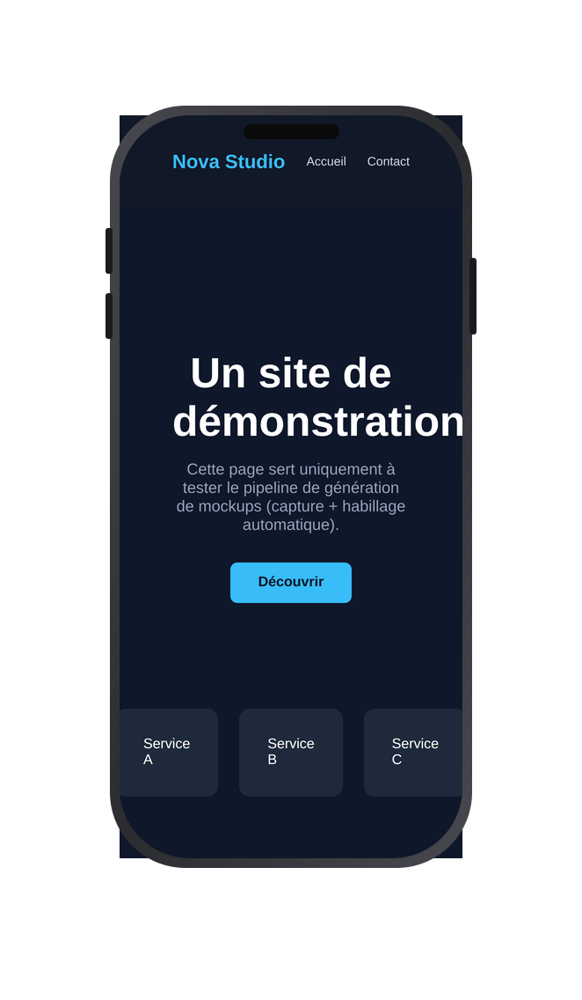

# mockup-pipeline

Pipeline automatisé pour générer les visuels de portfolio type cubicom.fr (mockup d'écran avec le site à l'intérieur, + galerie de captures internes), sans repasser à la main sur Photoshop/Figma à chaque nouveau projet.

Le pipeline fait deux choses, enchaînées automatiquement :

1. **Capture** — ouvre l'URL dans un vrai navigateur headless (Playwright/Chromium) et prend une capture d'écran à la résolution voulue.
2. **Habillage** — insère cette capture dans un cadre généré à la volée (moniteur, fenêtre de navigateur, ou téléphone) avec Sharp, ajoute un fond et une ombre portée, et sort une image PNG prête à l'emploi.

Aucune image de mockup à télécharger ou à acheter : les cadres sont dessinés par le script (SVG généré en fonction de la taille de la capture), donc ça marche pour n'importe quelle résolution sans dépendre d'un template figé.

## Installation

```bash
npm install
npx playwright install chromium   # télécharge le Chromium utilisé pour les captures (une seule fois)
```

## Utilisation rapide (un site à la fois)

Mockup "hero" encadré, prêt pour le haut de la page portfolio :

```bash
node src/cli.js hero \
  --url https://exemple-client.fr \
  --name "Exemple Client" \
  --template desktop \
  --background "#f4f2ee" \
  --out output
```

`--template` accepte `desktop` (moniteur sur pied), `browser` (fenêtre de navigateur) ou `mobile` (coque de téléphone bord à bord, écran + boutons + pastille caméra — voir capture ci-dessous). En viewport portrait par défaut (390×844), pas besoin de le préciser.



Galerie de captures brutes (plusieurs pages, habillage léger en fenêtre de navigateur, sans pied ni ombre — pour la section "galerie visuelle" de la page portfolio) :

```bash
node src/cli.js gallery \
  --base-url https://exemple-client.fr \
  --name "Exemple Client" \
  --pages "/,/contact,/equipe,/services" \
  --template browser \
  --out output
```

Carrousel de mockups encadrés (une image par page, gabarit `mobile` par défaut, avec ombre et marge — pour un carrousel en bas de page projet) :

```bash
node src/cli.js carousel \
  --base-url https://exemple-client.fr \
  --name "Exemple Client" \
  --pages "/,/contact,/equipe" \
  --background "#ffffff" \
  --out output
```

## Utilisation en lot (recommandé pour ajouter plusieurs projets d'un coup)

Tout se décrit dans un fichier JSON (voir `config/projects.example.json`) :

```json
{
  "outputDir": "output",
  "projects": [
    {
      "name": "Exemple Client",
      "baseUrl": "https://exemple-client.fr",
      "hero": {
        "path": "/",
        "template": "desktop",
        "viewport": { "width": 1440, "height": 900, "deviceScaleFactor": 2 },
        "background": "#f4f2ee",
        "padding": 140
      },
      "gallery": {
        "template": "browser",
        "viewport": { "width": 1280, "height": 800, "deviceScaleFactor": 2 },
        "pages": [
          { "path": "/", "label": "accueil" },
          { "path": "/contact", "label": "contact" }
        ]
      },
      "carousel": {
        "template": "mobile",
        "viewport": { "width": 390, "height": 844, "deviceScaleFactor": 3 },
        "background": "#ffffff",
        "padding": 100,
        "pages": [
          { "path": "/", "label": "accueil" },
          { "path": "/contact", "label": "contact" },
          { "path": "/equipe", "label": "equipe" }
        ]
      }
    }
  ]
}
```

Copie ce fichier en `config/projects.json`, ajoute une entrée par projet, puis :

```bash
node src/cli.js batch --config config/projects.json
```

Chaque projet ressort dans `output/<nom-du-projet>/` avec son mockup hero, sa galerie et son carrousel mobile. Pour ajouter les 5 prochains clients au portfolio, il suffit d'ajouter 5 blocs dans ce fichier et de relancer la commande — plus aucune manipulation manuelle. Un bloc (`hero`, `gallery` ou `carousel`) peut être omis si un projet n'en a pas besoin.

## Personnaliser les cadres

Les 3 gabarits sont dans `src/frames.js`, chacun sous forme d'une fonction qui reçoit la taille de la capture et retourne un SVG. Pour ajuster l'apparence (couleur du bezel, épaisseur, rayon des coins), passe des `frameOptions` dans la config :

```json
"hero": {
  "template": "desktop",
  "frameOptions": { "bezelColor": "#000000", "bezel": 30 }
}
```

Pour ajouter un 4ᵉ gabarit (ex: tablette), duplique une des fonctions existantes dans `frames.js`, adapte les proportions, et ajoute-la à l'objet `FRAMES` en bas du fichier — elle devient immédiatement disponible via `--template`.

## Notes pratiques

- **Mobile** : les commandes `hero`/`carousel` basculent automatiquement sur un viewport portrait (390×844, deviceScaleFactor 3) dès que `--template mobile` est utilisé — inutile de le préciser, sauf pour un autre format d'écran.
- **Résolution** : `deviceScaleFactor: 2` (2x, "retina") par défaut pour desktop/browser, `3` pour mobile — les images sortent nettes, à réduire au besoin côté CMS.
- **Cookies/bannières** : `capture.js` accepte un tableau `hideSelectors` (sélecteurs CSS à masquer avant la capture) pour retirer une bannière de consentement qui polluerait le mockup.
- **Sites lents / contenu différé** : ajuste `waitAfterLoadMs` dans `capture.js` (ou expose-le en option de config) si des éléments arrivent après le chargement initial (animations, lazy-load).
- **Fond et ombre** : `background` accepte `"transparent"` ou un hex (`"#f4f2ee"`). `padding` ajoute une marge autour du mockup avant export. Pour la galerie, l'ombre et le padding sont désactivés par défaut afin de garder des captures homogènes et facilement recadrables.

## Structure du projet

```
mockup-pipeline/
├── src/
│   ├── capture.js   # capture d'écran (Playwright)
│   ├── frames.js    # génération des cadres SVG (desktop / browser / mobile)
│   ├── compose.js   # assemblage capture + cadre + fond + ombre (Sharp)
│   └── cli.js        # commandes: hero / gallery / carousel / batch
├── config/
│   └── projects.example.json
├── doc/
│   └── preview-mobile.png
└── output/            # images générées (créé automatiquement)
```
